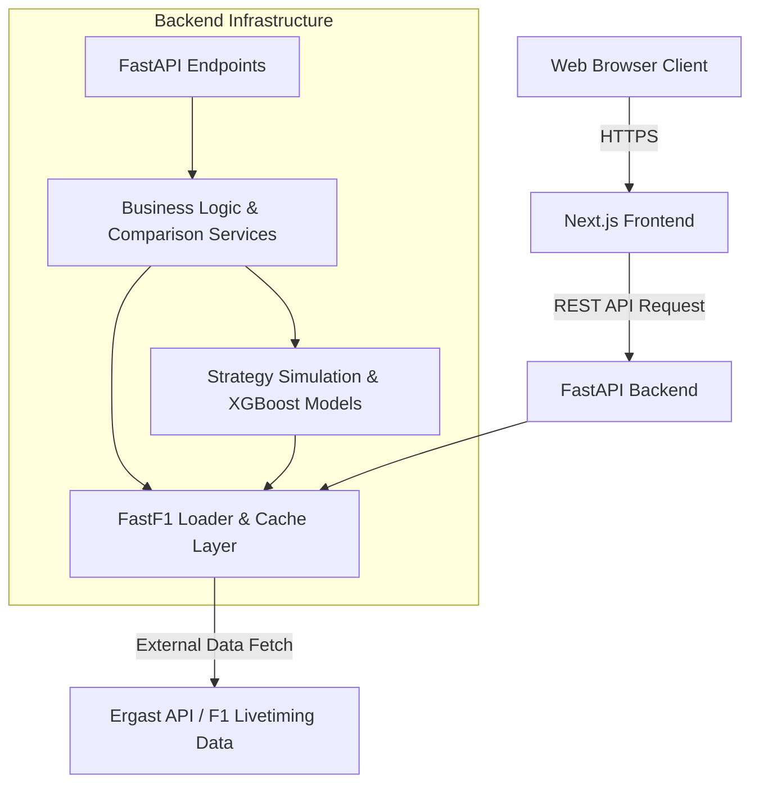
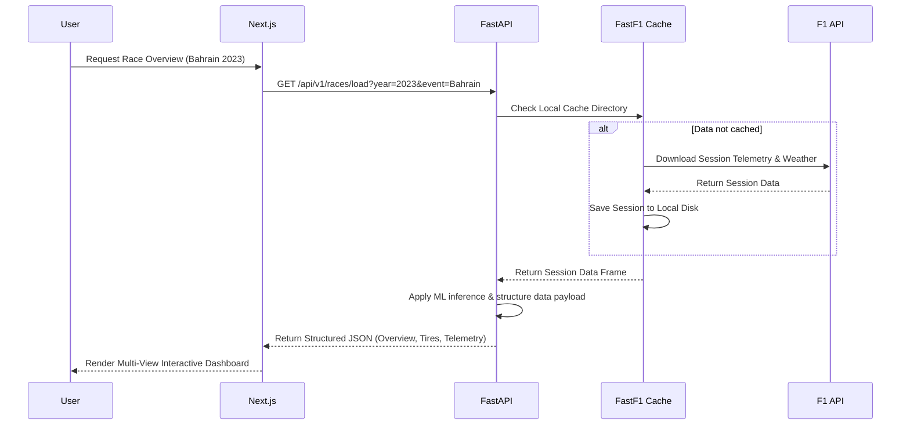

# APEX26 

Apex26 is an advanced Formula 1 data analytics, visualization, and race strategy simulation platform. It consumes telemetry data utilizing FastF1, runs machine learning predictions (XGBoost), and visualizes the results through an intuitive Next.js frontend interface representing race events, driver telemetry, stint strategies, tyre degradation, and gap analysis.

## Live Deployment

The application is deployed and accessible at:
- **Frontend App:** [F1xAI Web App](https://f1x-ai-dhu7-sushant-bots-projects.vercel.app/)
- **Backend API:** https://f1xai.onrender.com

## Screenshots

Add the following assets to `docs/images/` when final screenshots are available:

| Area | Suggested file |
| --- | --- |
| Telemetry dashboard | `docs/images/telemetry_dashboard.png` |
| Strategy recommendations | `docs/images/strategy_recommendations.png` |
| Gap analysis | `docs/images/gap_analysis.png` |

## Architecture Overview

The system architecture consists of a Next.js frontend communicating with a Python (FastAPI) backend. The backend utilizes FastF1 for fetching historical telemetry, processes the data through pandas/numpy arrays, applies predictive machine learning models, and serves structured JSON responses to the presentation layer.



## Data Application Flow



## Repository Structure

The repository is structured primarily into three overarching ecosystems:

*   **`frontend/`**: The modern web client. Built utilizing Next.js (App Directory), React, TypeScript, and TailwindCSS for responsive visualization.
*   **`backend/`**: The core API server. Built with FastAPI to handle CPU-intensive dataframe manipulation and ML calculation payloads securely.
*   **`apex26/`**: The legacy logical framework and standalone directory containing exploratory data analysis scripts, pipeline testing (`test_pipeline.py`), and foundational ML configuration (`backtest.py`).

### Backend Implementation

Handles all HTTP REST endpoints through `app/api/v1/`:
- **Race Data Services**: Processes driver stints, race positions, and segment times.
- **Telemetry Calculation**: Transpiles complex lap/driver telemetry payload grids.
- **Strategy & Energy Models**: ML-assisted strategy extrapolation and probability calculations.

### Frontend Implementation

Constructs high-fidelity, interactive dashboards housing dynamic components:
- **Telemetry View**: Real-time speed and throttle line-graph comparisons.
- **Strategy View**: Visual timeline representation of driver pit-windows and stint durability.
- **Gap Analysis View**: Driver Delta overlays per lap.
- **Race Replay View**: Synthetic sector engine for simulation rendering.

## Technology Stack

**Frontend Framework**
*   Next.js (React)
*   TailwindCSS
*   TypeScript

**Backend Logic**
*   Python 3.11+
*   FastAPI (REST API)
*   FastF1 (Telemetry Source Engine)
*   XGBoost / scikit-learn (Machine Learning)
*   Pandas / Numpy (Data Processing)
*   Cachetools (API Response Caching)

## Development Setup

### Prerequisites
*   Node.js (v18+)
*   Python 3.11+

### Backend Installation

1. Navigate to the backend working directory:
   ```bash
   cd backend
   ```
2. Create and activate a Python virtual environment:
   ```bash
   python -m venv venv
   source venv/bin/activate  # On Windows, utilize `venv\Scripts\activate`
   ```
3. Install project dependencies:
   ```bash
   pip install -r requirements.txt
   ```
4. Instantiate the backend server network:
   ```bash
   uvicorn app.main:app --reload --port 8000
   ```

### Frontend Installation

1. Navigate to the frontend working directory:
   ```bash
   cd frontend
   ```
2. Install npm dependencies:
   ```bash
   npm install
   ```
3. Configure the API base URL in `.env` or in the Vercel project settings:
   ```bash
   NEXT_PUBLIC_API_URL=https://f1xai.onrender.com
   ```
4. Initialize the development build suite:
   ```bash
   npm run dev
   ```

## Deployment Notes

The frontend expects the backend API to be reachable at the value provided in `NEXT_PUBLIC_API_URL`. In production, this should point to the Render deployment rather than localhost so that the browser can fetch race data successfully.
